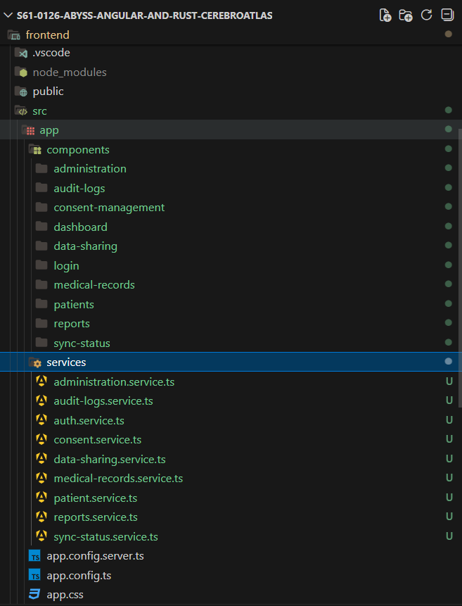
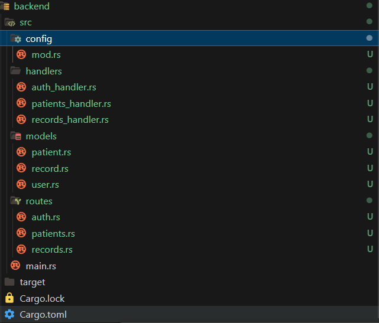
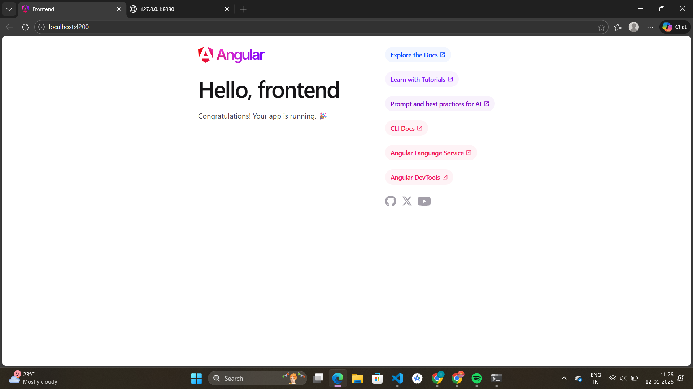
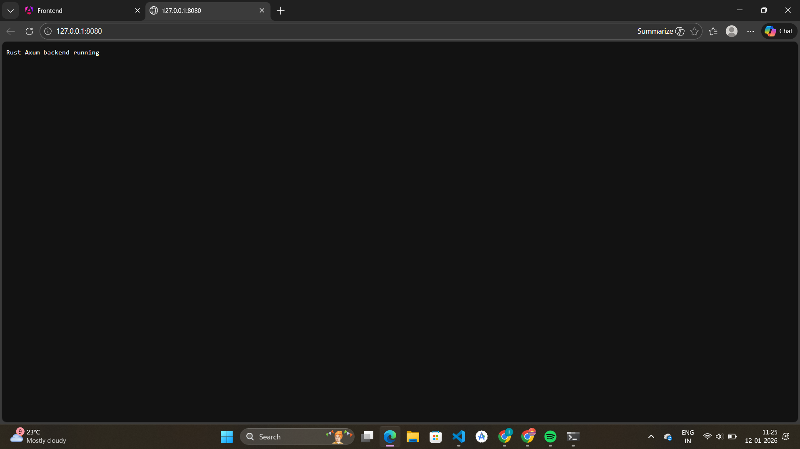
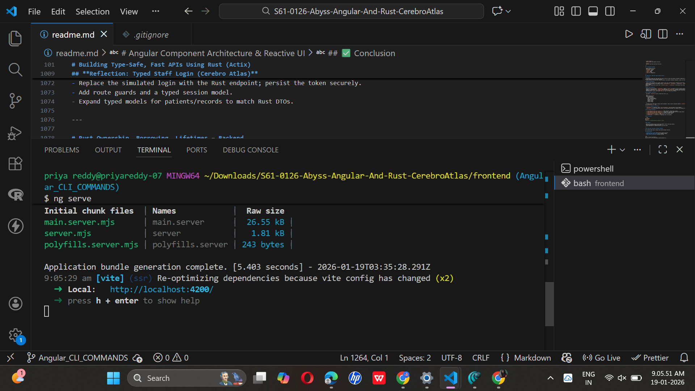
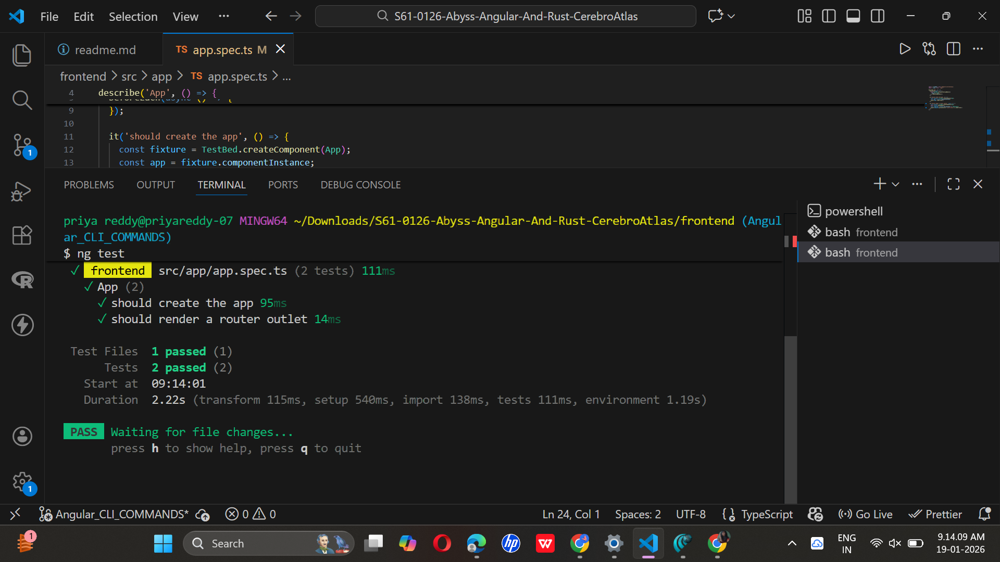
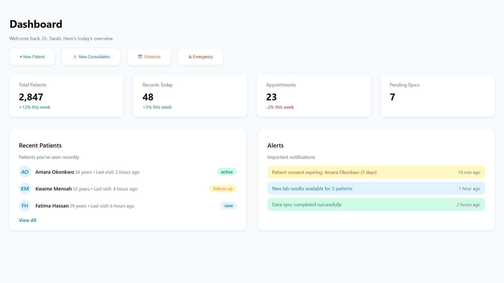

**Problem Statement**
Healthcare professionals in rural areas struggle to keep medical records unified. Patient data is often scattered across paper files or incompatible digital systems, making it difficult to access accurate medical history while maintaining patient privacy.

**Proposed Solution**
We propose a web-based interoperable digital health records system that enables healthcare professionals to securely create, store, and access patient records through a unified platform.

**Frontend – Angular**

**Components**

Angular components are responsible for the UI layer.

Render views and layouts

Handle user interactions (forms, buttons, navigation)

Invoke services to fetch or submit data

Update the UI based on API responses

Components do not contain business logic and remain lightweight.

**Services**

Angular services manage application logic and data flow.

Centralize reusable logic

Communicate with backend APIs

Handle data transformation and error handling

Share state across multiple components

Services act as the interface between components and backend APIs.

**HTTPClient**

Angular’s HttpClient handles all HTTP communication.

Sends REST API requests (GET, POST, PUT, DELETE)

Attaches headers such as authentication tokens

Handles asynchronous responses using Observables

Parses JSON responses from the backend

**Backend – Rust APIs**

The backend is implemented using Rust to ensure performance, safety, and reliability.

Exposes RESTful API endpoints

Validates and processes incoming requests

Executes business logic

Communicates with the PostgreSQL database

Returns structured JSON responses to the frontend

Rust APIs serve as the single access layer to the database.

**Database – PostgreSQL**

PostgreSQL is used for data persistence and integrity.

Stores application data securely

Supports relational data and complex queries

Ensures consistency and reliability

Accessed only through the Rust backend

**End-to-End Request Flow**

The following diagram represents the complete request lifecycle:

User
↓
Angular Component
↓
Angular Service
↓
HTTPClient
↓
Rust API
↓
PostgreSQL Database
↓
Rust API Response
↓
Angular Service
↓
Angular Component
↓
UI Update

# Building Type-Safe, Fast APIs Using Rust (Actix)

## Overview

This repository demonstrates my understanding of building **fast, secure, and type-safe backend APIs** using **Rust** and the **Actix Web framework**.
The project explains how a Rust backend receives requests from an Angular frontend, processes structured data using typed handlers, optionally interacts with PostgreSQL, and returns JSON responses.

The goal of this assignment is **conceptual clarity**, not complexity.

---

## Why Rust Is a Strong Backend Choice

Rust is increasingly used for backend systems because it provides:

- **Memory Safety** without garbage collection
- **High performance** comparable to C/C++
- **Zero-cost abstractions**
- **Fearless concurrency** for handling multiple requests safely
- **Compile-time guarantees** that reduce runtime failures

Because of these strengths, Rust is widely adopted by companies like Amazon, Cloudflare, Discord, Dropbox, and Figma.

**Key Insight:**
If a Rust API compiles successfully, it is usually correct and stable.

---

## How a Rust API Server Works

A Rust backend handles HTTP requests using the following building blocks:

### 1. Routes

Routes map HTTP paths and methods to handler functions.

Example:

```
rust
#[post("/api/items")]
```

This tells the server to run the handler when a POST request is sent to `/api/items`.

---

### 2. Handlers

Handlers contain the logic for processing a request and generating a response.

```
rust
async fn create_item(...) -> impl Responder
```

Handlers are asynchronous, allowing the server to handle many users simultaneously.

---

### 3. Structs & Type Safety

Rust uses strongly typed structs to validate request and response data.

``
`rust #[derive(Deserialize)]
struct CreateItem {
name: String,
quantity: i32,
}

```

This ensures:

* The request contains the correct fields
* The data types are valid
* Errors are caught at compile time

---

### 4. Async Execution

Rust uses `async/await` to avoid blocking threads while handling requests or database operations.

---

## Example API Endpoint

Below is a simple POST endpoint implemented using **Actix Web**.

### Endpoint Code (`main.rs`)

```

rust
use actix_web::{post, web, App, HttpResponse, HttpServer, Responder};
use serde::Deserialize;

#[derive(Deserialize)]
struct CreateItem {
name: String,
quantity: i32,
}

#[post("/api/items")]
async fn create_item(item: web::Json<CreateItem>) -> impl Responder {
println!("Received item: {} - {}", item.name, item.quantity);

    HttpResponse::Ok().json(format!(
        "Item created: {} with quantity {}",
        item.name, item.quantity
    ))

}

#[actix_web::main]
async fn main() -> std::io::Result<()> {
HttpServer::new(|| {
App::new()
.service(create_item)
})
.bind(("127.0.0.1", 8080))?
.run()
.await
}

```

---

### What Happens in This Endpoint

1. Angular sends a POST request with JSON data
2. Rust converts the JSON into a `CreateItem` struct
3. The handler processes the request
4. A JSON response is returned

Example request:

```

json
{
"name": "Keyboard",
"quantity": 10
}

```

Example response:

```

json
"Item created: Keyboard with quantity 10"

```

---

## Connecting to PostgreSQL (Conceptual)

In real-world applications, handlers interact with PostgreSQL using libraries like **SQLx**.

Example SQLx query:

```

rust
sqlx::query!(
"INSERT INTO items (name, quantity) VALUES ($1, $2)",
item.name,
item.quantity
)
.execute(&pool)
.await?;

```

### Benefits:

* Safe prepared statements
* Protection against SQL injection
* Async database access
* Compile-time verification of SQL queries

---

## Full Request–Response Flow

The architecture follows this sequence:

```

Angular Component (Form Submit)
↓
Angular Service (HTTP POST)
↓
Rust Route (/api/items)
↓
Rust Handler (Validates Input using Structs)
↓
PostgreSQL (Insert Query)
↓
JSON Response
↓
Angular Updates UI

```
---

## Case Study: Adding a New Product

### Scenario:

A user submits a form to add a new product:

* **Name:** Laptop
* **Quantity:** 5

### Step-by-Step Flow:

1. User submits the form in Angular.
2. Angular service sends a POST request to `/api/items` with JSON data.
3. Rust route matches the endpoint and invokes the handler.
4. The handler deserializes JSON into the `CreateItem` struct.
5. Rust executes a PostgreSQL INSERT query.
6. The database stores the product.
7. Rust returns a success JSON response.
8. Angular receives the response and updates the UI.

---

## Why Type Safety Improves API Development

Using type safety in Rust APIs provides:

* Early error detection
* Fewer runtime crashes
* Predictable request handling
* Safer refactoring
* More reliable production systems

Type safety ensures correctness **before deployment**, not after failure.

---

## Conclusion

This project demonstrates the foundational concepts of building **fast, type-safe, and reliable APIs** using Rust and Actix.
Understanding routes, handlers, structs, and async workflows enables scalable and maintainable backend systems.


---

# **Creating Interactive, Modular Frontends with Angular**

---

## **1. Explanation of Angular Components & Services**

### **Angular Components**

In our project, Angular components are used to divide the UI into **small, reusable, and independent blocks**, making the application easy to scale and maintain.

For the healthcare records system, we design components such as:

* **LoginComponent** – handles doctor authentication UI
* **DashboardComponent** – displays patient records overview
* **PatientFormComponent** – used to add or update medical records
* **PatientListComponent** – displays a list of patients

Each component contains:

* **HTML** for structure
* **TypeScript** for logic
* **CSS** for styling

This separation ensures that UI logic remains clean and manageable.

---

### **Angular Services**

Services are used to handle **shared logic and API communication** instead of embedding that logic inside components.

In our project, services are responsible for:

* Communicating with the Rust backend
* Fetching patient data
* Sending patient record updates
* Managing authentication tokens

This approach ensures that:

* Components focus only on UI
* API logic is centralized
* Code is reusable and easier to test

---

## **2. Diagram: Angular UI Interaction with Rust Backend**

```

Angular Component (UI)
↓
Angular Service (HTTP Client)
↓
Rust REST API (Actix / Axum)
↓
Business Logic Layer
↓
PostgreSQL Database
↓
JSON Response
↓
Angular Service
↓
Angular Component (UI Updates Automatically)

```

This flow ensures **clear frontend–backend separation** and smooth interoperability.

---

## **3. Simple UI Feature Implemented Using Angular Components**

### **Feature: Add Patient Medical Record**

**Description:**
A doctor logs in and adds a patient’s medical record through a form.

**Components Involved:**

* `PatientFormComponent`
* `PatientListComponent`

**UI Flow:**

1. Doctor opens dashboard
2. Clicks “Add Patient”
3. Fills patient details
4. Submits form
5. UI updates automatically with new patient record

This feature demonstrates:

* Component reuse
* Event handling
* Reactive UI updates

---

## **4. Sample Angular Service Calling a Rust API Endpoint**

```

ts
@Injectable({ providedIn: 'root' })
export class PatientService {
constructor(private http: HttpClient) {}

addPatient(patientData: any) {
return this.http.post('/api/patients', patientData);
}

getPatients() {
return this.http.get('/api/patients');
}
}

```

**Explanation:**

* The service sends HTTP requests to Rust APIs
* Components subscribe to responses
* Rust returns JSON data
* Angular updates the UI automatically

This design keeps API communication **clean and scalable**.

---

## **5. Routing Structure Used in the UI**

```

ts
const routes: Routes = [
{ path: 'login', component: LoginComponent },
{ path: 'dashboard', component: DashboardComponent },
{ path: 'patients', component: PatientListComponent }
];

```

**Purpose:**

* Enables multi-page navigation
* Keeps UI structured
* Improves user experience for healthcare professionals

---

## **6. How Modular Architecture Supports the Project**

Our Angular application follows a **modular architecture**, where:

* Each feature has its own module
* Components are grouped logically
* Services are shared across modules

Example structure:

```

AppModule
├── AuthModule
├── PatientModule
├── DashboardModule
└── SharedModule

```

This structure ensures:

* Easy feature expansion
* Clear ownership of code
* Reduced bugs during scaling

---

## **7. Reflection: Why Modular Architecture Improves Scalability**

Modular architecture improves scalability because:

* Features can be added without breaking existing code
* Teams can work independently on modules
* Code becomes easier to test and debug
* Backend API changes affect only services, not UI components

For our healthcare records system, this is critical because:

* Medical data systems evolve continuously
* New features like reports or integrations can be added later
* Privacy and security logic stays centralized

---

## **Conclusion**

By using Angular’s component-driven and service-based architecture, we created a **clean, scalable, and maintainable frontend** that integrates seamlessly with a **Rust backend**. This design directly supports the project goal of building **interoperable and privacy-preserving digital health records**.

---

# Sprint #2 – Full-Stack Environment Setup (Angular + Rust)

## Overview

This repository contains the complete environment setup for **Sprint #2**, covering both **Angular frontend** and **Rust backend (Actix or Axum)**. The goal of this setup is to ensure that the full-stack development environment is correctly installed, configured, and verified before starting feature development.

A correct setup at this stage prevents common tooling, dependency, and runtime issues later in the sprint.

---

## Objectives

By completing this setup, the following goals are achieved:

* Run Angular applications locally using Angular CLI
* Build and run Rust web servers using Actix or Axum
* Verify installation through successful builds and local servers
* Push both frontend and backend into a single GitHub repository
* Create a Pull Request (PR) as proof of environment readiness
* Record a short demo video showing both applications running

---

## Repository Structure

```

Cerebro-Atlas/
│
├── frontend/ # Angular application
│
├── backend/ # Rust backend (Actix or Axum)
│
└── README.md # Environment setup documentation

```

---

## STEP 1 – Angular CLI Setup

### 1. Install Node.js (LTS)

Download and install Node.js (LTS version):

```

https://nodejs.org/en

```

Verify installation:

```

node -v
npm -v

```

---

### 2. Install Angular CLI

Install Angular CLI globally:

```

npm install -g @angular/cli

```

Verify installation:

```

ng version

```

---

### 3. Create Angular Project

Navigate to the frontend directory and create the project:

```

ng new frontend
cd frontend
ng serve

```

Expected output:

```

Compiled successfully

```

Verify in browser:

```

http://localhost:4200/

```

---

## STEP 2 – Rust Toolchain Setup

### 1. Install Rust using rustup

Run the following command:

```

curl --proto '=https' --tlsv1.2 -sSf https://sh.rustup.rs | sh

```

Restart the terminal after installation.

---

### 2. Verify Rust Installation

```

rustc --version
cargo --version

```

---

### 3. Add Essential Rust Components

```

rustup component add clippy
rustup component add rustfmt

```

These tools help maintain code quality and formatting.

---

## STEP 3 – Rust Backend Setup (Choose ONE)

Create the backend project:

```

cargo new backend
cd backend

```

---

### Option A – Actix-Web Backend

#### Dependencies (`Cargo.toml`)

```

actix-web = "4"
serde = { version = "1", features = ["derive"] }
serde_json = "1"

```

#### Starter Server (`src/main.rs`)

```

use actix_web::{get, App, HttpServer, Responder};

#[get("/")]
async fn hello() -> impl Responder {
"Rust backend is running"
}

#[tokio::main]
async fn main() -> std::io::Result<()> {
HttpServer::new(|| App::new().service(hello))
.bind(("127.0.0.1", 8080))?
.run()
.await
}

```

Run server:

```

cargo run

```

Verify in browser:

```

http://localhost:8080/

```

---

### Option B – Axum Backend (Axum 0.7+)

#### Dependencies (`Cargo.toml`)

```

axum = "0.7"
tokio = { version = "1", features = ["full"] }
serde = { version = "1", features = ["derive"] }
serde_json = "1"

```

#### Starter Server (`src/main.rs`)

```

use axum::{routing::get, Router};
use tokio::net::TcpListener;

async fn hello() -> &'static str {
"Rust Axum backend running"
}

#[tokio::main]
async fn main() {
let app = Router::new().route("/", get(hello));

    let listener = TcpListener::bind("127.0.0.1:8080").await.unwrap();
    println!("Running on http://127.0.0.1:8080");

    axum::serve(listener, app).await.unwrap();

}

```

Run server:

```

cargo run

```

Verify in browser:

```

http://localhost:8080/

```


# Exploring Angular and Rust Project Structures

##  Project Overview

This project demonstrates the **default folder structures of an Angular frontend and a Rust backend (Actix/Axum)**.
The goal is to understand how both frameworks organize code for **scalable, maintainable, and modular development**, and how they communicate in a real-world full-stack application.

This submission focuses on **project structure exploration**, not full feature implementation.

---

##  Angular Frontend Structure

The Angular application was created using:

```

bash
ng new frontend

```

###  Key Directories & Files

```

src/
├── app/
│ ├── app.component.ts
│ ├── app.component.html
│ ├── app.component.css
│ ├── app.module.ts
│ ├── components/
│ │ └── product/
│ │ ├── product.component.ts
│ │ ├── product.component.html
│ │ └── product.component.css
│ └── services/
│ └── product.service.ts
├── assets/
├── environments/
angular.json
package.json

````

###  Explanation of Key Files

* **`src/app/`**
  Contains all application logic including components, services, and routing.

* **`app.component.*`**
  Root component of the Angular application. All other components are rendered inside it.

* **`app.module.ts`**
  The heart of the Angular app. Registers components, services, and imports required modules.

* **`components/`**
  Contains UI building blocks. Each feature is isolated into its own component folder.

* **`services/`**
  Handles business logic and API calls to the Rust backend using `HttpClient`.

* **`angular.json`**
  Controls build configuration and assets.

* **`package.json`**
  Lists project dependencies like Angular core libraries and RxJS.

---

##  Rust Backend Structure (Actix/Axum)

The Rust backend was created using:

```bash
cargo new rust-backend
````

### Key Directories & Files

```
src/
 ├── main.rs
 ├── routes/
 │   └── products.rs
 ├── handlers/
 │   └── product_handler.rs
 ├── models/
 │   └── product.rs
 ├── config/
Cargo.toml
```

### Explanation of Key Files

- **`main.rs`**
  Entry point of the Rust application. Initializes the server and registers routes.

- **`routes/`**
  Defines API endpoints and maps them to handlers.

- **`handlers/`**
  Contains business logic. Processes incoming requests and returns responses.

- **`models/`**
  Stores request and response structs and database models.

- **`config/`**
  (Optional) Used for environment variables, database configuration, and app settings.

- **`Cargo.toml`**
  Rust dependency manager file. Declares libraries like Actix, Serde, and Tokio.

---

## How Angular and Rust Communicate

The communication follows a clean request–response flow:

```
Angular Component
 → Angular Service
 → Rust Route
 → Rust Handler
 → (Database)
 → Response
 → UI Update
```

- Angular services make HTTP requests
- Rust routes receive requests
- Handlers process logic and return responses
- Angular updates the UI accordingly

---

## Case Study: "Create Product" Feature

### 🔹 Angular Files Involved

- `components/product/product.component.ts`
  Displays the UI form for creating a product.

- `services/product.service.ts`
  Sends POST request to backend API.

- `app.module.ts`
  Registers the component and service.

### 🔹 Rust Files Involved

- `routes/products.rs`
  Defines `/products` endpoint.

- `handlers/product_handler.rs`
  Contains logic to create a product.

- `models/product.rs`
  Defines request and response structures.

- `main.rs`
  Registers the routes and starts the server.

---

## 📸 Screenshots Included

- Angular project file tree
- Rust project file tree
- `components/` folder
- `services/` folder
- `routes/` folder
- `models/` folder
- `Cargo.toml` dependencies

### Visuals















---

## **Reflection: Typed Staff Login (Cerebro Atlas)**

**Overview**

- Implemented a typed staff login page that accepts staff ID or email plus password, designed to demonstrate TypeScript types, Angular data integrity, and how the frontend can align with Rust contracts.
- Branded experience and predictable component behavior using Angular standalone components, signals, and reactive forms.

**TypeScript Confidence**

- Typed variables showcased in UI: number, boolean, array, and a structured object (rendered as “Tech stack”, “Topics”, etc.).
- Defined core interfaces in the Angular service: `StaffCredentials`, `StaffProfile`, `LoginResponse`, `LoginMetadata`, and an internal `AuthPayload` for request shaping.
- Wrote typed functions and a small class: `AuthService.login()`, `buildPayload()` with explicit return type, and `StaffLoginAudit` constructor for audit sampling.

**Angular Data Integrity**

- Reactive form with validators: `staffIdOrEmail` required, `password` min-length 8 to mirror backend expectation.
- Signals for predictable state: `feedback` (status/message) and `loginMetadata` (computed), enabling explicit UI states: idle/pending/success/error.
- Dependency injection with `inject(FormBuilder)` and `inject(AuthService)` prevents “used before initialization” issues and keeps constructors clean.
- Routing wired to `/login` and a minimal `app.html` shell for Cerebro Atlas branding.

**Rust Alignment (Contracts)**

- The Angular `AuthPayload` mirrors a likely Rust struct, e.g.:
  ```
  rust
  #[derive(Deserialize)]
  struct AuthPayload {
      identity: String,
      email: Option<String>,
      staff_id: Option<String>,
      password: String,
      channel: String,
      device: String,
      version: String,
  }
  ```
- Frontend enforces shape before sending; when the backend is ready, swap the simulated response in `AuthService.login()` with a typed `HttpClient.post<LoginResponse>(...)` call.

**Predictable Components & Services**

- `LoginComponent` is standalone, imports `ReactiveFormsModule`, and uses signals to drive feedback.
- `AuthService` centralizes authentication logic, returning typed observables; the component only handles UI flow.

**Files Touched (Frontend)**

- `src/app/components/login/login.component.ts` — typed component, reactive form, signals.
- `src/app/components/login/login.component.html` — login form + type demo badges with user-friendly labels.
- `src/app/components/login/login.component.css` — focused, accessible styling.
- `src/app/services/auth.service.ts` — typed interfaces and simulated login.
- `src/app/app.routes.ts` — route to `/login`.
- `src/app/app.html`, `src/app/app.css` — lightweight shell and branding.

**How to Try It**

```bash
cd frontend
npm install
ng serve
# Open http://localhost:4200 and navigate to /login
```

**Next Steps**

- Replace the simulated login with the Rust endpoint; persist the token securely.
- Add route guards and a typed session model.
- Expand typed models for patients/records to match Rust DTOs.

---

# Rust Ownership, Borrowing, Lifetimes – Backend

Rust prevents memory bugs at compile time without garbage collection.

## Ownership Rules

- **Single owner per value**: Each value has exactly one owner
- **Drops when owner goes out of scope**: Automatic cleanup
- **Move transfers ownership**: No double-free bugs

```
rust
let s1 = String::from("hello");
let s2 = s1;  // s1 is now invalid, ownership moved to s2
```

## Borrowing

- **`&T` (immutable)**: Multiple immutable borrows allowed
- **`&mut T` (mutable)**: Only one mutable borrow at a time

```
rust
fn len(s: &String) { println!("{}", s.len()); }
fn push(s: &mut String) { s.push('!'); }
```

## Lifetimes

Ensures references don't outlive the data they reference:

```
rust
fn longest<'a>(x: &'a str, y: &'a str) -> &'a str {
    if x.len() > y.len() { x } else { y }
}
```

## Backend Handler Pattern

```
rust
#[get("/user")]
async fn get_user(pool: web::Data<DbPool>) -> impl Responder {
    let conn = pool.get()?;
    let user = query_user(&conn);  // Safe borrow
    HttpResponse::Ok().json(user)
}
```

**Key Insight**: If it compiles, it's memory-safe. No null pointer dereferences, no data races, no memory leaks.

# Angular Component Architecture & Reactive UI

## Login Component Assignment

## Objective

To demonstrate understanding of **Angular’s component-based architecture** and **reactive UI model** using a **Login Component**.

---

## Component Overview

Angular applications are built using **components**.
Each component controls:

- UI (HTML)
- Logic (TypeScript)
- Styling (CSS)

This assignment uses a **Login Component** to show how Angular handles user input and UI updates reactively.

---

## Component Structure

```
login/
 ├── login.component.ts
 ├── login.component.html
 ├── login.component.css
```

---

## Component Definition

```
ts
@Component({
  selector: 'app-login',
  templateUrl: './login.component.html',
  styleUrls: ['./login.component.css']
})
export class LoginComponent {
  email = '';
  password = '';
}
```

The `@Component` decorator defines:

- Component selector
- Template file
- Style file

---

## Template Binding Used

### Interpolation

```
html
<p>{{ email }}</p>
```

Automatically updates the UI when data changes.

---

### Event Binding

```
html
<button (click)="onSubmit()">Sign In</button>
```

Handles user actions like button clicks.

---

### Form Binding (Reactive Forms)

```
html
<input formControlName="email">
<input formControlName="password">
```

Angular automatically tracks input changes and updates the UI.

---

## Reactive UI & Change Detection

Angular automatically updates the UI when:

- User types in input fields
- A button is clicked
- Form validation state changes

Example:

```
ts
onSubmit() {
  console.log(this.loginForm.value);
}
```

No manual DOM updates are required — Angular handles everything reactively.

---

## Component Behavior

- User enters email and password
- Form validation runs automatically
- Clicking **Sign In** triggers submission
- UI updates based on form state

---

## Conclusion

This assignment demonstrates:

- Angular component architecture
- Reactive form handling
- Event-driven UI updates
- Automatic change detection

The **Login Component** represents a real-world example of how Angular builds reactive user interfaces.

# Angular CLI Commands – Generate, Serve, Build, and Test (Learning : DATE : 19-01-2026 )

## Objective

The purpose of this task is to understand and apply essential Angular CLI commands used in real-world Angular development. This includes generating components, serving the application locally, creating production builds, and running unit tests.

---

## Tools & Technologies Used

- Angular
- Angular CLI
- Node.js & npm
- TypeScript
- Karma & Jasmine (Unit Testing)

---

## Angular CLI Installation

Install Angular CLI globally (if not already installed):

```bash
npm install -g @angular/cli
```
# Angular Components Dashboard (Date: 19-01-2026)

## Overview

This project demonstrates the fundamentals of **Angular component architecture**, templates, styling, and reactive UI updates. It was built as part of **Kalvium – Module 3.13: Creating Angular Components, Templates, and Styles**.

The application showcases a **Dashboard UI** composed of reusable Angular components such as action cards, stats cards, recent patients, and alerts—illustrating how complex UIs are built from small, self-contained components.

## Key Concepts Covered

* Angular component-based architecture
* Component creation using Angular CLI
* Template syntax (interpolation & event binding)
* Component-level styling (CSS encapsulation)
* Reactive UI updates through state changes

## Features Implemented

* **Dashboard Layout** with modular UI sections
* **Action Cards**

  * New Patient
  * New Consultation
  * Schedule
  * Emergency
* **Statistics Cards**

  * Total Patients
  * Records Today
  * Appointments
  * Pending Syncs
* **Recent Patients Section**

  * Displays recently visited patients
  * Shows status indicators (active, follow-up, new)
* **Alerts Panel**

  * Consent expiry notifications
  * Lab results updates
  * Data sync status

## Component Structure

Each UI feature is implemented as a reusable Angular component with its own logic, template, and styles.

```
src/app/
│── components/
│   ├── dashboard/
│   │   ├── dashboard.component.ts
│   │   ├── dashboard.component.html
│   │   ├── dashboard.component.css
│   ├── stats-card/
│   ├── action-card/
│   ├── recent-patients/
│   ├── alerts/
│── app.component.ts
│── app.component.html
```

## Technologies Used

* **Angular**
* **TypeScript**
* **HTML5**
* **CSS3**
* **Angular CLI**

## Angular Concepts Demonstrated

* `@Component` decorator usage
* Data binding using `{{ }}` interpolation
* Event binding using `(click)`
* Component state updates and automatic UI re-rendering
* Scoped styles per component

## How to Run the Project

1. Install dependencies:

   ```
   bash
   npm install
   ```
2. Start the development server:

   ```
   bash
   ng serve
   ```
3. Open in browser:

   ```
   http://localhost:4200/dashboard
   ```

## Learning Outcome

By building this project, I learned how to:

* Break a UI into logical Angular components
* Connect templates with component logic
* Apply component-scoped styling
* Build reactive and maintainable UIs

These skills directly support building scalable frontend features for **Sprint #2 projects** and beyond.

---

# Building Responsive Layouts with Angular (Flexbox & CSS Grid)

## Overview

Modern web applications are accessed across a wide range of devices including mobile phones, tablets, laptops, and large desktop screens. To ensure a consistent and usable experience, user interfaces must adapt automatically to different screen sizes without breaking layout or usability.

This task focuses on implementing **responsive layouts in Angular** using modern CSS techniques such as **Flexbox** and **CSS Grid**, with an optional introduction to **Angular Flex Layout utilities**.

---

## Objective

The objective of this task is to understand and apply **responsive design principles** by building Angular components that adapt gracefully across screen sizes using:

- CSS Flexbox for one-dimensional layouts
- CSS Grid for two-dimensional layouts
- Media queries for fine-grained control
- Angular data binding for dynamic content

By completing this task, the UI should automatically rearrange, resize, and adapt smoothly across devices without the need for separate mobile or desktop applications.

---

## What Is Responsive Design?

Responsive design refers to creating a single flexible UI that:

- Adjusts layout based on screen width
- Keeps content readable on all devices
- Reorganizes UI components intelligently
- Avoids horizontal scrolling or broken views

Instead of maintaining separate codebases for mobile and desktop, a single responsive layout is used.

---

## CSS Flexbox – One-Dimensional Layouts

CSS Flexbox is ideal for layouts that flow in **one direction** (row or column).

### Key Concepts Demonstrated:
- `display: flex`
- `flex-wrap` for automatic wrapping
- `gap` for spacing
- Flexible sizing using `flex: 1 1 200px`

### Behavior:
- Items appear in a row on larger screens
- Items wrap automatically on smaller screens
- Spacing and proportions are maintained

Flexbox is especially useful for toolbars, lists, and simple content sections.

---

## CSS Grid – Two-Dimensional Layouts

CSS Grid is designed for layouts involving both **rows and columns**, making it ideal for dashboards and card grids.

### Key Concepts Demonstrated:
- `display: grid`
- `repeat(auto-fit, minmax(250px, 1fr))`
- `gap` for consistent spacing

### Behavior:
- Automatically adjusts the number of columns based on screen width
- No media queries required in most cases
- Creates clean and scalable layouts

---

## Responsive Breakpoints Using Media Queries

While Grid and Flexbox handle most responsiveness automatically, media queries are used when additional control is required.

### Example Use Case:
- Switching a Flexbox layout from row to column when the screen width is below `768px`

This ensures better readability and usability on smaller devices.

---

## Angular Flex Layout (Optional)

Angular Flex Layout provides directive-based responsive utilities such as:

- `fxLayout`
- `fxFlex`
- `fxLayoutGap`
- Responsive aliases like `lt-md`

This task does not require Angular Flex Layout, but it is introduced as an optional approach for achieving responsiveness with minimal CSS.

---

## Combining Responsiveness with Angular Data Binding

Responsive layouts work best when combined with Angular’s template features.

### Demonstrated Techniques:
- `*ngFor` to render dynamic data
- Responsive Grid layout that adapts as data changes

As the data grows or shrinks, the layout remains responsive without additional code changes.

---

## Practical UI Example

The task includes a **responsive product grid** that behaves as follows:

- **Desktop:** 4 cards per row
- **Tablet:** 2 cards per row
- **Mobile:** 1 card per row

This behavior is achieved using **CSS Grid with `auto-fit` and `minmax()`**, mirroring real-world dashboards and e-commerce layouts.

---

## Clean Responsive Design Practices Followed

- Flexbox and Grid are preferred over floats
- Fixed widths are avoided
- `minmax()`, `auto-fit`, and `fr` units are used
- Layout is mobile-friendly and scalable
- Design is easy to test using browser developer tools

---

## Project Alignment

This component is integrated into the Angular project as a routed page and serves as a **foundational UI exercise**.  
The layout techniques demonstrated here can later be reused in dashboards, data views, and feature components within the project.

---

## Outcome

By completing this task, the following have been achieved:

- Understanding of responsive design principles
- Practical implementation of Flexbox and CSS Grid
- Use of media queries for fine control
- Integration of responsive layouts with Angular data binding
- A clean, readable, and evaluation-safe solution

This setup prepares the project for building more complex, responsive UI features in future sprints.

---

# Angular Data Binding Assignment – Patients Page

## Assignment Overview

This assignment demonstrates the implementation of Angular data binding concepts by building a Patients Management page in an Angular application. The work is based on Kalvium Lesson 3.16: Data Binding in Angular.

The Patients page displays patient information and allows user interaction through search, filters, and action buttons while maintaining a responsive and dynamic UI.

---

## Concepts Covered

The following Angular concepts from the lesson have been applied in this assignment:

* Interpolation
* Property Binding
* Event Binding
* Two-Way Binding using ngModel
* Component-based UI development
* Angular routing
* Responsive UI design using CSS

---

## Features Implemented

* Patients page with a card-based layout
* Display of patient details such as name, age, gender, location, contact number, appointment date, medical conditions, and status
* Search bar for filtering patients
* Filter and Export buttons
* Tabs for different patient categories
* Routing to the Patients page using Angular Router
* Scoped component styles to avoid global CSS conflicts

---

## Data Binding Usage

### Interpolation

Used to display dynamic patient data in the HTML template.

Example:
{{ patient.name }}
{{ patient.age }}

---

### Property Binding

Used to dynamically control HTML element properties based on component logic.

Example:
[disabled]="isDisabled"

---

### Event Binding

Used to handle user interactions such as button clicks.

Example:
(click)="registerPatient()"

---

### Two-Way Binding

Used for real-time synchronization between input fields and component data.

Example:
[(ngModel)]="searchText"

FormsModule was imported to support ngModel.

---

## Component Structure

* patients.component.ts
* patients.component.html
* patients.component.css

Each component follows Angular’s separation of logic, template, and styles.

---

## Routing

A dedicated route was added for the Patients page. Navigating to /patients loads the Patients component.

---

## How to Run the Project

1. Install dependencies
   npm install

2. Run the Angular development server
   ng serve

3. Open the application in the browser
   [http://localhost:4200/patients](http://localhost:4200/patients)

---

## Learning Outcome

Through this assignment, I gained hands-on experience with Angular data binding techniques and learned how to build responsive and interactive user interfaces using Angular components.
